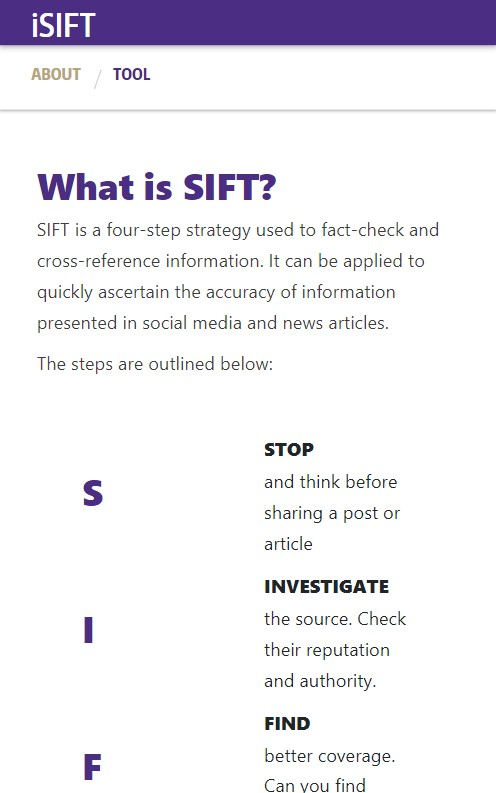

# SIFT-COVID
Team Visionaries:
- Judith Wong
- Jazmynn Combes-Troyer
- Saasha Mor
- Joseph Altamira

In collaboration with the University of Washington [iSchool](https://ischool.uw.edu/) and [Center for an Informed Public](https://www.cip.uw.edu/)

## Table of Contents
- [Problem context](#problem-context)
- [Our Solution](#our-solution)
- [Technology used](#technology-used)
- [Features Demo](#demo)
- [Setup](#setup)
- [Status](#status)

## Problem Context
Our project deals with combating misinformation, particularly about COVID-19 and vaccines. This is important today, because false information about COVID can confuse people and cause them to do things that might endanger the health and well-being of others. One way to fight misinformation is to promote media literacy, which is people’s ability to recognize misinformation.

From our research we found the following:
- Facebook is one of the most influential platforms used to spread info
- Many people rely on others (friends, relatives) to fact-check info for them; saves time and energy
- People are wary about political biases and agendas present in the way info is presented

On the basis of this we aim to target people who might have health-related concerns about the covid vaccine and are hesitant about the info they find on FB. Such people have a need to find reliable information as quickly and efficiently as possible.

## The Solution
To combat this problem we created a tool that helps users quickly find information about news article they read in a concise manner. We will help users apply the SIFT method to critically analyze information and ascertain the accuracy of information presented in social media and news articles.
SIFT is a four-step strategy used to fact-check and cross-reference information.
- S: **STOP**  and think before sharing a post or article
- I: **INVESTIGATE** the source. Check their reputation and authority.
- F: **FIND** better coverage. Can you find similar claims elsewhere?
- T: **TRACE** claims, quotes, and media to its original context.

We will do so with the help of two tools created by Team Visionaries
- **[SIFTY Chatbot](https://www.facebook.com/iSift-102773021888658)**: Chats with users about the article they see on Facebook and provides resources on how to fact-check it
- **[Information Extraction Web Tool](https://isift.herokuapp.com/)**: Summarizes key info and provides tips that will help expedite the fact checking process

**NOTE: iSIFT is NOT an information hub; our goal is to summarize info and promote media literacy**

## Demo
Watch how to use this tool [here](https://youtu.be/kfD-5SUe68g)

## Technologies
- Python version: Python 3.9
- Third-Party extensions
    - [Flask](https://flask.palletsprojects.com/en/1.1.x/)
    - [Newspaper3k](https://newspaper.readthedocs.io/en/latest/)
    - [Beautiful Soup](http://beautiful-soup-4.readthedocs.io/)
    
## Setup
- Run locally:

  Install all dependencies using pip:
  `pip install -r requirements.txt`

  Execute `flask run` in the directory. The application will be live at http://127.0.0.1:5000/
- For development:

  [TBD]

## Status
Development In Progress
